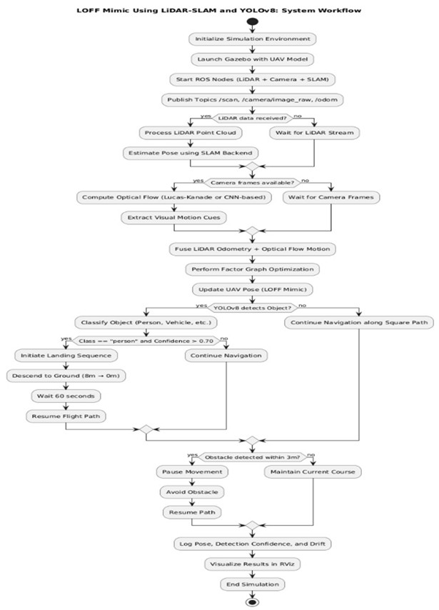

# Autonomous Drone Simulator for Disaster Monitoring

[](https://docs.ros.org/en/humble/)
[](https://gazebosim.org/)
[](https://ardupilot.org/)
[](./LICENSE)
[](https://www.python.org/)
[](https://isocpp.org/)

> A high-fidelity autonomous UAV simulation framework for disaster response, integrating multi-sensor fusion and real-time AI perception.

---

## 📋 Table of Contents
- [Overview](#-overview)
- [System Architecture](#%EF%B8%8F-system-architecture)
- [Key Features](#-key-features)
- [Tech Stack](#-tech-stack)
- [Results](#-results)
- [Getting Started](#-getting-started)
- [Documentation](#-documentation)
- [Repository Structure](#-repository-structure)
- [License](#-license)

---

## 🔍 Overview
This project presents a fully simulated **Autonomous Disaster Response Drone** that integrates [LiDAR-Optical Flow Fusion (LOFF)](https://www.mdpi.com/2504-446X/8/8/432) odometry with **YOLOv8-based semantic perception** to enable robust navigation in **GPS-denied environments** such as earthquake zones, flood areas, and disaster sites.

The platform was built using **ROS 2 Humble**, **Gazebo Garden**, and **ArduPilot SITL** — enabling rigorous hardware-free testing with realistic physics.

---

## 🏗️ System Architecture



The system is composed of five tightly coupled subsystems:
1. **Sensor Simulation** — LiDAR and RGB Camera modeled in Gazebo
2. **Optical Flow Estimation** — Dense motion vectors from sequential image frames
3. **LiDAR-SLAM Fusion** — Point cloud alignment with Factor Graph Optimization
4. **Semantic Perception** — YOLOv8 real-time object detection
5. **Autonomous Decision-Making** — Confidence-based landing and dynamic avoidance

---

## ✨ Key Features
| Feature | Description |
|---|---|
| 🗺️ **GPS-Denied Navigation** | Stable pose estimation via LiDAR-SLAM + Optical Flow FGO |
| 👁️ **Human Detection** | YOLOv8 detects victims with a 70% confidence threshold |
| 🛬 **Autonomous Landing** | Triggered upon confirmed human detection |
| 🚧 **Obstacle Avoidance** | LiDAR laser rays maintain a 3m safety distance |
| 🌍 **Realistic Simulation** | ROS 2 + Gazebo with maze, hills, and runway worlds |

---

## 🛠️ Tech Stack
- **Simulation**: ROS 2 Humble · Gazebo Garden · ArduPilot SITL · MAVProxy
- **Perception**: YOLOv8 (Darknet ROS) · OpenCV · PyTorch
- **Localization**: Google Cartographer SLAM · Micro-XRCE-DDS
- **Languages**: C++17 · Python 3.10
- **Build Tools**: Colcon · CMake · Rosdep

---

## 📊 Results

| Metric | Result |
|---|---|
| Localization Drift Reduction | **38%** vs. single-sensor |
| Object Detection mAP@0.5 | **91.3%** |
| Inference Speed | **60 FPS** real-time |

### Simulation Screenshots

| Gazebo Environment | LiDAR-Avoidance |
|:---:|:---:|
|  |  |
| *Virtual World in Gazebo* | *LiDAR Obstacle Avoidance* |

| Simulation Setup | YOLOv8 Detection |
|:---:|:---:|
|  |  |
| *Integrated ROS + Gazebo Setup* | *YOLO Confidence Analysis (73% vs 48%)* |

---

## 🚀 Getting Started

### Prerequisites
```bash
# Ubuntu 22.04 recommended
sudo apt install ros-humble-desktop python3-colcon-common-extensions
```

### Quick Start
```bash
# 1. Clone the repository
git clone https://github.com/your-username/Autonomous-Drone-Simulator.git
cd Autonomous-Drone-Simulator

# 2. Build the ROS 2 workspace
mkdir -p ~/ardu_ws/src && cd ~/ardu_ws/src
colcon build --packages-up-to ardupilot_gz_bringup

# 3. Launch the simulation
source install/setup.bash
ros2 launch ardupilot_gz_bringup iris_maze.launch.py lidar_dim:=2
```

> 📖 For the full step-by-step setup, see the [Installation and Execution Guide](./docs/Execution_Guide.md).

---

## 📖 Documentation

| Document | Description |
|---|---|
| [Introduction](./docs/Introduction.md) | Project background, objectives, and literature review |
| [System Overview](./docs/System_Overview.md) | Architecture, software stack, and design methodology |
| [Execution Guide](./docs/Execution_Guide.md) | Full installation and step-by-step execution walkthrough |
| [Results & Conclusion](./docs/Results_and_Conclusion.md) | Performance metrics, figures, and future work |
| [References](./docs/References.md) | Academic and technical citations |

---

## 📁 Repository Structure

```text
Capstone-Thesis-Drone-Simulator/
│
├── README.md                    # Project overview (this file)
├── LICENSE                      # MIT License
│
├── docs/                        # Technical Documentation
│   ├── Introduction.md          # Project background & objectives
│   ├── System_Overview.md       # Architecture & methodology
│   ├── Execution_Guide.md       # Installation & execution guide
│   ├── Results_and_Conclusion.md # Results, analysis & conclusion
│   └── References.md            # Academic citations
│
├── assets/
│   └── figures/                 # All diagrams and screenshots
│       ├── Picture1.jpg         # System architecture diagram
│       ├── Figure 3.1.1.jpg     # SITL Simulation
│       ├── Figure 3.1.2.jpg     # Gazebo + ROS
│       ├── Figure 3.1.3.jpg     # MAVProxy interface
│       ├── Figure 3.2.png       # Gazebo + YOLO
│       ├── Figure 4.1.png       # Virtual World
│       ├── Figure 4.2.svg       # Simulation Setup
│       ├── Figure 4.3.png       # LiDAR Drone
│       └── Figure 4.4.svg       # YOLO Output
│
└── src/                         # Source Code
    ├── SLAM_LIDAR_Model.cpp     # LiDAR-SLAM navigation & avoidance
    └── Yolo_Object_Detector.cpp # YOLOv8 ROS integration

```

---

## 🤝 Contributing

Contributions are welcome! If you have ideas to improve the simulator, add new Gazebo worlds, enhance the perception model, or extend the navigation algorithms — feel free to open an issue or submit a pull request.

```bash
# Fork the repo, then:
git checkout -b feature/your-feature-name
git commit -m "Add: your feature description"
git push origin feature/your-feature-name
# Then open a Pull Request on GitHub
```

Please keep your code well-commented and consistent with the existing style.

---

## 🙏 Acknowledgements

This project builds upon the outstanding work of several open-source communities and researchers:

| Project | How It Was Used |
|---|---|
| [ROS (Robot Operating System)](https://ros.org/) | Core middleware — publishers, subscribers, node lifecycle |
| [ArduPilot](https://ardupilot.org/) | Flight controller running in SITL mode for realistic drone dynamics |
| [Gazebo](https://gazebosim.org/) | Physics-based 3D simulation worlds (maze, hills, runway) |
| [Darknet (pjreddie)](https://github.com/pjreddie/darknet) | The underlying neural network engine used for YOLO inference |
| [darknet_ros](https://github.com/leggedrobotics/darknet_ros) | ROS wrapper publishing bounding boxes and detection events |
| [MAVROS](http://wiki.ros.org/mavros) | MAVLink bridge for sending velocity commands to ArduPilot (`/mavros/setpoint_velocity/cmd_vel`) |
| [OpenCV + cv_bridge](https://opencv.org/) | Camera image decoding and conversion between ROS and OpenCV formats |
| [Boost C++ Libraries](https://www.boost.org/) | Thread management and shared-memory mutex for concurrent detection |
| [Intelligent Quads (IQ_GNC)](https://github.com/Intelligent-Quads/iq_gnc) | High-level GNC helper functions (`takeoff`, `land`, `set_destination`, `check_waypoint_reached`) |
| Zhang & Singh — *LOAM* | SLAM research that informed the localization and mapping approach |
| Zhang et al. — *LOFF* | LiDAR and Optical Flow Fusion Odometry — the core localization algorithm |

---
## 📰 Publication

This project is accompanied by a research paper published on Zenodo:

**Enhanced Multi-Modal UAV Perception using Large Language Models 
for Autonomous Disaster Reconnaissance**

https://zenodo.org/records/20442636

> If you use this work, please cite:
> Bhavya Keerthi K. (2026). Enhanced Multi-Modal UAV 
> Perception using Large Language Models for Autonomous Disaster 
> Reconnaissance. Zenodo. https://doi.org/10.5281/zenodo.20442636


## 📄 License

This project is licensed under the **MIT License** — see the [LICENSE](./LICENSE) file for details.

---

<div align="center">
  <i>Built with ROS 2 · Gazebo · ArduPilot · YOLOv8</i>
</div>
